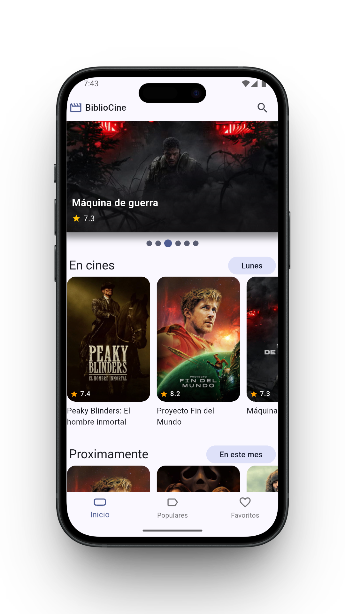
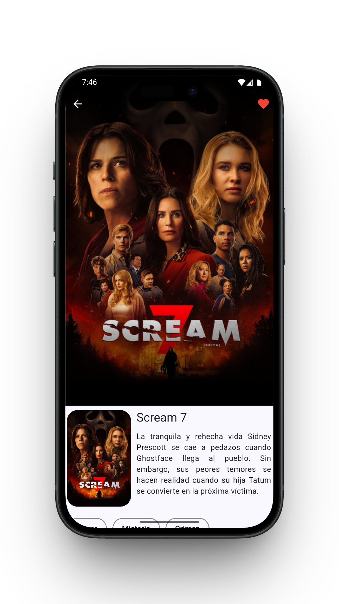
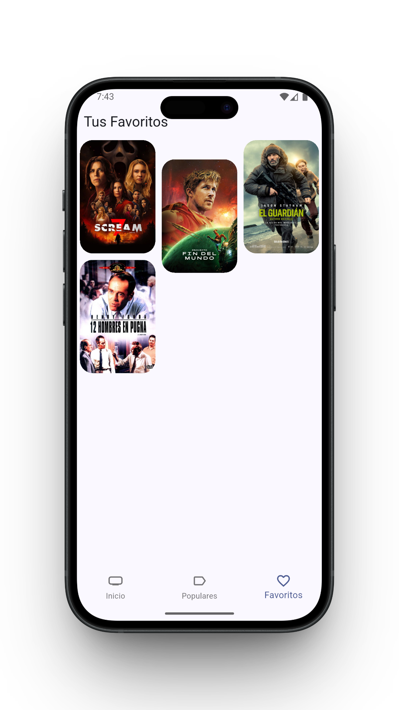
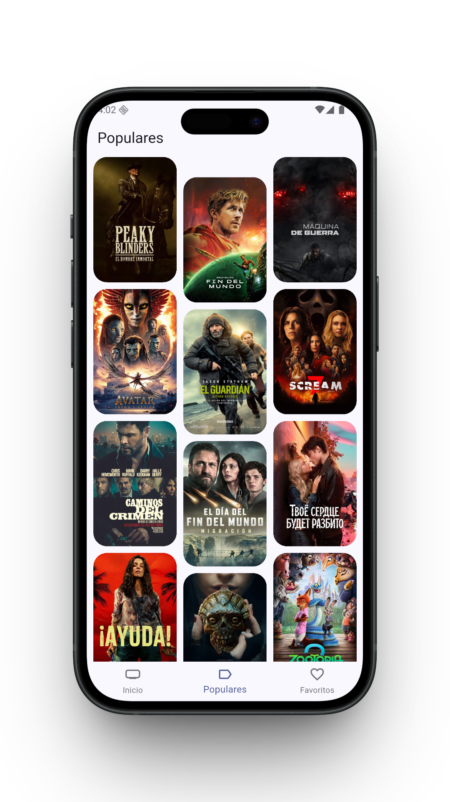
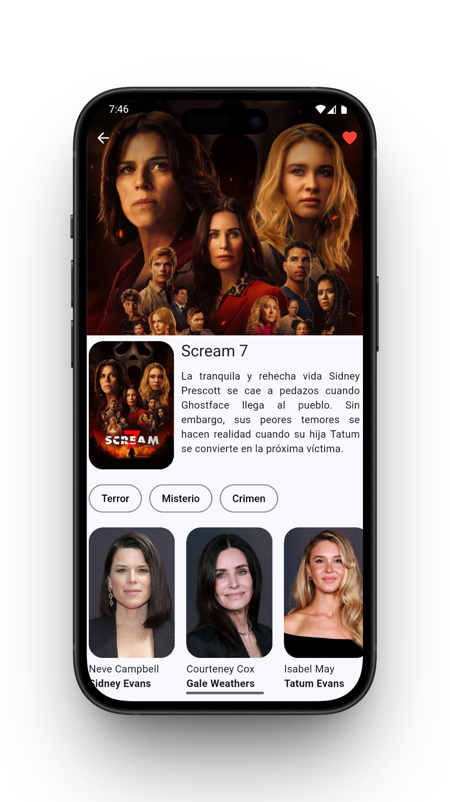
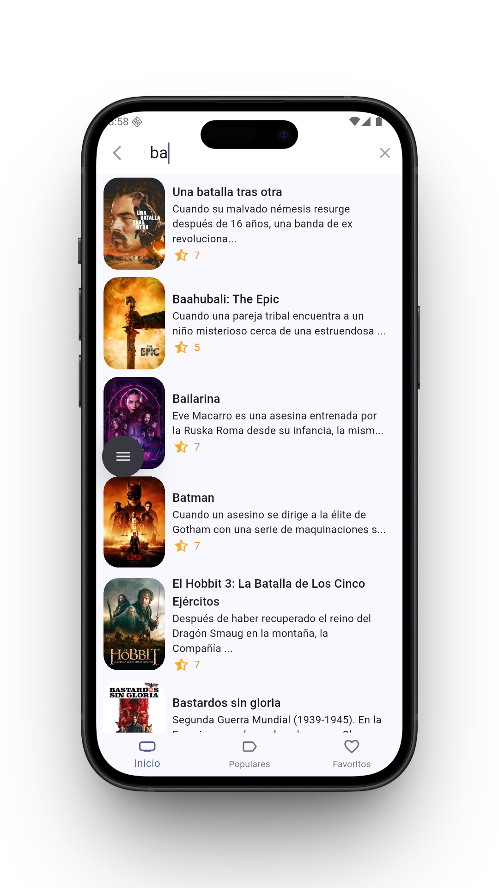

# 🎬 BiblioCine 
[](https://flutter.dev)
[](https://dart.dev)
[](https://blog.cleancoder.com/uncle-bob/2012/08/13/the-clean-architecture.html)

**BiblioCine** es una solución móvil de alto rendimiento diseñada para la exploración cinematográfica. No es solo un catálogo; es un proyecto que demuestra el dominio de **Clean Architecture**, **gestión de estado reactiva** y **persistencia de datos robusta** en el ecosistema Flutter.

> Construida bajo principios **SOLID** y escalabilidad real, integrando la API de TMDB.

## 📸 Capturas de Pantalla
| Home Screen | Detalle de Película | Favoritos |
| :---: | :---: | :---: |
|  |  |  |

| Populares | Detalle de Película | Búsqueda |
| :---: | :---: | :---: |
|  |  |  |

## ✨ Funcionalidades Principales

BiblioCine no es solo un catálogo, es una experiencia completa para amantes del cine que incluye:

* **🎬 Exploración de Tendencias:** Consulta las películas más populares y las mejor valoradas en tiempo real gracias a la integración con la API de TMDB.
* **🔍 Búsqueda Inteligente:** Encuentra tu película favorita por su título con una interfaz de búsqueda rápida y reactiva.
* **💾 Favoritos:** Guarda tus películas favoritas en una base de datos local utilizando **Drift (SQLite)**, para consultarlas.
* **📱 Detalles Completos:** Información detallada de cada entrega, incluyendo sinopsis, géneros y calificación.
* **🚀 Carga Optimizada:** Implementación de scroll infinito utilizando paginación y manejo eficiente de imágenes para una navegación fluida.
* **🎨 Interfaz Moderna:** Diseño minimalista y profesional siguiendo las mejores prácticas de UX/UI en Flutter.

## 🛠️ Stack Tecnológico

Este proyecto utiliza las herramientas más modernas del ecosistema Flutter

* **Framework:** [Flutter](https://flutter.dev/)
* **Arquitectura:** Clean Architecture Pragmática (Capas: `Infrastructure`, `Domain`, `Presentation`).
* **Gestión de Estado:** [Riverpod Generator](https://riverpod.dev/) (Estado reactivo con seguridad de tipos).
* **Persistencia Local:** [Drift](https://drift.simonbinder.eu/) (Motor SQLite).
* **Networking:** [Dio](https://pub.dev/packages/dio) (Cliente HTTP robusto para APIs).
* **Navegación:** [GoRouter](https://pub.dev/packages/go_router) (Rutas declarativas y fuertemente tipadas).

## 🏛️ Arquitectura y Estructura del Proyecto

**BiblioCine** está desarrollado siguiendo los principios de **Clean Architecture**, asegurando un código escalable y con una separación estricta de responsabilidades.

### 🧩 Patrones Implementados
* **Repository Pattern:** Centraliza el acceso a los datos.
* **Dependency Injection:** Gestión de dependencias mediante Providers de Riverpod.
* **SOLID Principles:** Código limpio y fácil de testear.
  
### ⚡ Modern Dart Tooling
Para mejorar la seguridad tipada y reducir el código repetitivo, el proyecto utiliza **Code Generation**:
* **Riverpod Generator:** Para una gestión de estado más robusta y autogestionada.
* **GoRouter:** Implementación de rutas declarativas.
* **Drift:** Generación de código para consultas SQL seguras y reactivas.

### 📂 Estructura de Carpetas

```text
lib/
├── config/             # Configuraciones globales: constantes, helpers, GoRouter y Theme.
├── domain/             # Capa de Dominio (Pura):
│   ├── datasources/    # Contratos (interfaces) para las fuentes de datos.
│   ├── entities/       # Entidades puras de negocio (Movie, Actor).
│   └── repositories/   # Contratos para la persistencia de datos.
├── infrastructure/     # Capa de Infraestructura (Datos):
│   ├── datasources/    # Implementación de datos (local con SQLite/Drift y remote con TMDB API).
│   ├── mappers/        # Transformación de modelos de la API (DTOs) a Entidades de dominio.
│   ├── models/         # Modelos de datos específicos (local y moviedb).
│   └── repositories/   # Implementación real de los repositorios.
├── presentation/       # Capa de Presentación (UI y Estado):
│   ├── delegates/      # Lógica delegada, como el SearchDelegate para la búsqueda de películas.
│   ├── providers/      # Gestión de estado reactiva con Riverpod (actores, búsqueda, películas, storage).
│   ├── screens/        # Pantallas completas de navegación.
│   ├── views/          # Vistas secundarias o fragmentos manejados dentro de las pantallas.
│   └── widgets/        # Componentes visuales reutilizables (compartidos y específicos).
└── main.dart           # Punto de arranque y configuración de Providers globales.

```
### 🧠 Decisiones Arquitectónicas y Pragmatismo

Este proyecto implementa una versión **pragmática** de Clean Architecture, adaptada a las mejores prácticas del ecosistema moderno de Flutter:

* **¿Por qué no hay capa de Casos de Uso (Use Cases)?:** Para evitar el exceso de código repetitivo (*boilerplate*), se omitió la creación de clases tradicionales de Casos de Uso. En su lugar, **Riverpod** (mediante sus Providers y Notifiers) asume el rol de orquestador/interactor. Los Providers consumen directamente los Repositorios, manteniendo el flujo de datos unidireccional, limpio y directo sin sacrificar el principio de responsabilidad única.
* **Protección del Dominio (Mappers):** Las APIs de terceros (como TMDB) pueden cambiar sus contratos o enviar datos nulos de imprevisto. La capa de `Mappers` en la infraestructura se encarga de parsear y limpiar estos datos antes de convertirlos en Entidades de Dominio, asegurando que la aplicación no sufra caídas por datos corruptos.
* **Encapsulamiento con Archivos Barril:** Se utilizan *Barrel Files* (ej. `screens.dart`, `providers.dart`) a lo largo del proyecto. Esto reduce drásticamente el ruido visual de las importaciones en la cabecera de los archivos, haciendo que el código sea mucho más fácil de leer y mantener.
* **Aislamiento de Fuentes de Datos:** Al separar los *datasources* en `local` (Drift) y `remote` (Dio/TMDB), la lógica de negocio ignora por completo de dónde provienen los datos, lo que hace que el sistema sea altamente escalable y fácil de testear.
  
## ⚙️ Instalación y Configuración

Para ejecutar este proyecto localmente:

1. **Clonar el repositorio:**
   ```bash
   git clone https://github.com/VladimirOJDev/BiblioCine.git
   ```
2. Copiar el env.template y renombarlo a .env en la raíz del proyecto.
   ```bash
    cp env.template .env
    ```
3. Cambiar las variables de entorno (The MovieDB)
   Abre el archivo .env y añade tu llave:
    ```bash
    MOVIE_DB_KEY=tu_api_key_aqui
    ```
4. Instalar dependencias y generar código:
   ```bash
   flutter pub get
   flutter pub run build_runner build --delete-conflicting-outputs
    ```
5. Ejecutar la aplicación
   ```bash
    flutter run
    ```
---

### 🍿 Créditos e Información de Datos
Este proyecto utiliza la API de **[The Movie Database (TMDB)](https://www.themoviedb.org/)** para obtener toda la información, imágenes y metadatos de las películas.

> **Aviso Legal:** Esta aplicación utiliza la API de TMDB pero no está avalada ni certificada por TMDB. Todos los derechos de las imágenes y datos de las películas pertenecen a sus respectivos dueños.


